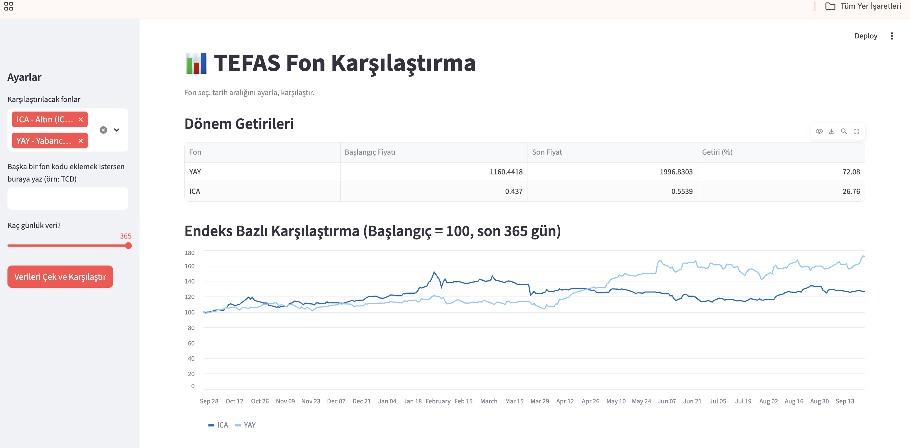

# TEFAS Fund Tracker

A Python learning project that pulls historical fund data from TEFAS
(Turkey's Electronic Fund Trading Platform) and visualizes it for
comparison across fund categories.

## Contents

- `fon_cek.py` — Fetches historical price data for a single fund and
  plots it.
- `fon_karsilastir.py` — Compares multiple funds on an indexed basis
  (start = 100), producing a summary table and a comparison chart.
- `app.py` — Interactive dashboard built with Streamlit, running in
  the browser.

## Setup

\`\`\`
python3 -m venv venv
source venv/bin/activate
pip install -r requirements.txt
\`\`\`

## Usage

\`\`\`
python fon_cek.py              # single fund
python fon_karsilastir.py      # multi-fund comparison
streamlit run app.py           # interactive dashboard
\`\`\`

## What I learned

- TEFAS's undocumented API changed over time, and how a maintained
  community library (tefas-crawler) solved that fragility
- Data cleaning and transformation with pandas
- Building a quick interactive interface with Streamlit

## Known Limitations

- Relies on the `tefas-crawler` community library to talk to TEFAS's
  undocumented API. TEFAS changed this API in 2026 (the original
  direct-request approach broke with a 404), so this dependency could
  require an update again in the future if TEFAS changes its backend.
- Fund codes are entered manually; there's no built-in search/lookup
  against TEFAS's full fund list yet.
- Data freshness depends on TEFAS's own publishing schedule (funds
  are typically priced once per business day).
